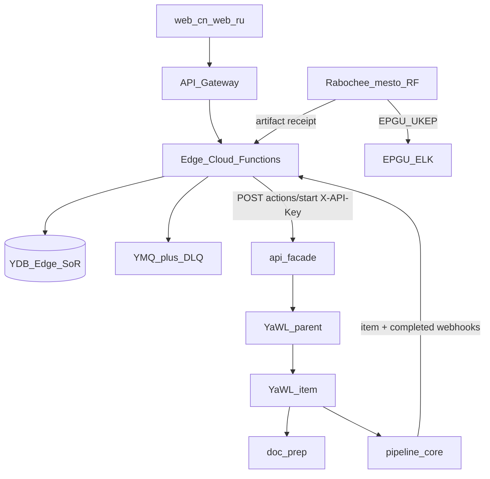

# Edge: разрез и волны

**Дата среза:** 1 сентября 2026 года.  
**Смежные:** [`functions.md`](functions.md), [`ydb.md`](ydb.md), [`cutover.md`](cutover.md), продуктовый вид [`07-backendnoe.md`](https://github.com/SinopticsAI).

## 1. Четыре исполнителя

| Слой | Репозиторий | Что владеет | Чего не делает |
| --- | --- | --- | --- |
| **Edge** | этот репозиторий | API Gateway, Cloud Functions, YDB SoR, YMQ/DLQ, поллеры | Не вызывает YaWL напрямую; не гоняет OCR/LLM дольше лимита функции |
| **Plane** | `pharma-plane` | `api-facade` + YaWL + `doc-prep` + `pipeline-core` + Plane_YDB | Не хранит карточки SPA; не биллит; не заявитель на ЕПГУ |
| **Hermes** | `hostingervps_hermes` | Публичный поиск, дайджесты, Telegram | Не хранит досье и ПДн; не логинится в ЕСИА; VPS не контур 152-ФЗ |
| **Рабочее место РФ** | вне облака | УКЭП, КриптоПро, браузер ЕПГУ / ЕЛК / Regmed | Не «робот в облаке» |

Контракт cutover как у Logos: Edge всегда бьёт в HTTP facade (`POST .../actions/start` + `X-API-Key`). Workflow id — внутренность Plane. Откат = смена `PHARMA_PLANE_BASE_URL`.

## 2. Поток на каждый новый продукт

Компания и УПП уже есть — Edge не повторяет онбординг юрлица. На SKU стартует кейс.

Стадии кейса: `onboarding → qualification → case → roadmap → dossier → samples → filing → expertise → registry → postreg`.

## 3. Честная граница автоматизации

| Задача | Кто | Режим |
| --- | --- | --- |
| Поиск аналогов (виджет МИ, ГРЛС, ФСА) | Edge `registry_search` | read, кэш, не истина |
| Загрузка досье | Edge `dossier_items` + S3 РФ | write в наш бакет |
| OCR, комплектность, противоречия | Plane `pharma-dossier` | write в бакет/Plane_YDB |
| Черновик полей 201н / 630782 | Plane → JSON в кейс | draft; человек копирует |
| Подача 610095 / 630782 | рабочее место РФ | human-submit |
| Квитанция, номер заявления | Edge `filing_artifact` | writeback **к нам** |
| Статус экспертизы | сначала `status_ingest` | propose → confirm |
| Ожидание регулятора | Edge `calendar_tick` | не держать в одном YaWL (лимит 48 ч) |

Нет функции `epgu_submit`. Если появится изолированный RPA в РФ — отдельный репозиторий и отдельный SA, не Hermes и не этот Edge.

## 4. Что оставляем из Logos и что не переносим

Оставляем: poller → start → facade; `settings.workflow` ≠ `item_type`; `409` если уже processing; claim-check oversized JSON; YMQ + DLQ; `pipeline_events`.

Не переносим: автоwriteback во внешнюю систему как истину; `auto_create` кейса из внешней таблицы; долгий sleep внутри container poller.

## 5. Волны внедрения

| Волна | Что поднимаем | Зачем |
| --- | --- | --- |
| **1** | `cases*` + `dossier_items` + S3 + `status_ingest` + `calendar_tick` + ручной `registry_search` | Кабинет без госкиоска |
| **1b** | Plane `pharma-dossier` | Файлы проверены, не «подано» |
| **2** | `filing_package` / `filing_artifact`, `mail_poller`; Plane `pharma-request`, `pharma-qualify` | Оператор готовит 201н/630782 |
| **2b** | `hermes_dispatch` + `pharma_intel` | Аналоги и новости, всегда propose |
| **3** | `registry_poller`, API ФСА, выгрузка для брокера | После стабильного контракта |
| **никогда** | автоподача ЕПГУ, ключи УКЭП в Lockbox, досье на Hostinger | слой A/B не подменяем |

Демо `pharma.sinoptics.ru` пока без этих функций. Волна 1 вешает OpenAPI на шлюз; бакет досье **отдельный** от статики `pharma-sinoptics-ru`.
